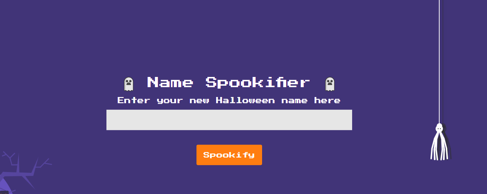
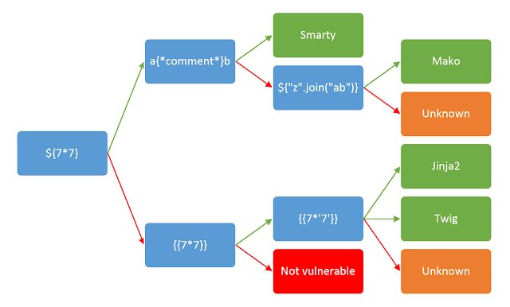

# Spookifier - web challenge


We are presented with a page that prompts us to send a "name" to it.



By default, when I encounter a case like this, I try to exploit Server-Side Template Injection (SSTI). You can learn more about SSTI on this website.




${7*7} yields 49 !

Now let's take a look at the template engine used in the source code.

```
from flask import Blueprint, request
from flask_mako import render_template
from application.util import spookify

web = Blueprint('web', __name__)

@web.route('/')
def index():
    text = request.args.get('text')
    if(text):
        converted = spookify(text)
        return render_template('index.html',output=converted)
    
return render_template('index.html',output='')
```   

Notice these lines:

`from flask_mako import render_template `

` return render_template('index.html',output=converted)`


We can see that the webserver includes the Mako template engine. Furthermore, the user-provided input is passed to the engine without any input filtering, making it clearly an SSTI vulnerability.
Let's find a suitable exploit from the blog I mentioned earlier to get the flag.


For some reason, the payloads from HackTricks, PayloadsAllTheThings, and other sources for this type of SSTI didn't work. So, I tested things and came up with this Local File Inclusion (LFI) exploit: ${open("/etc/passwd").read()}.

Let's read the flag using this code: ${open("/flag.txt").read()}.


Done :)

