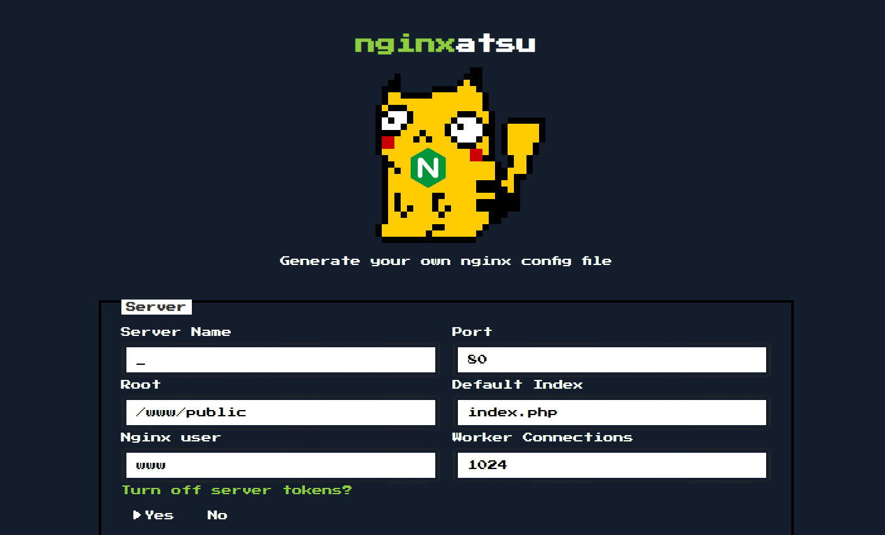
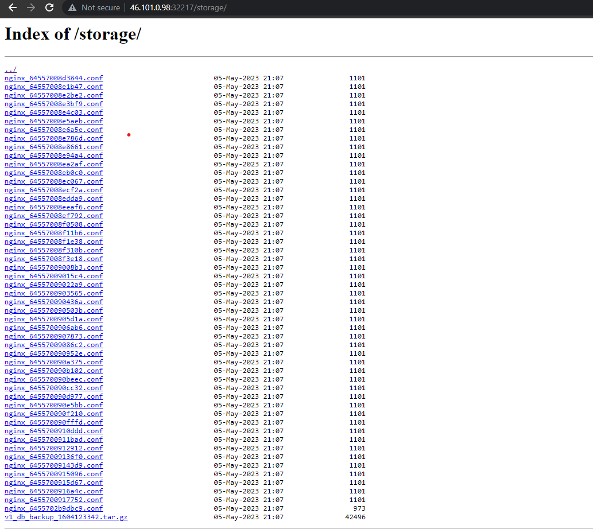
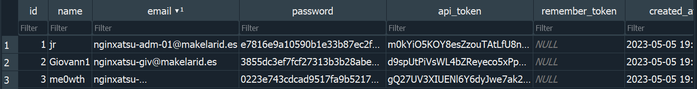
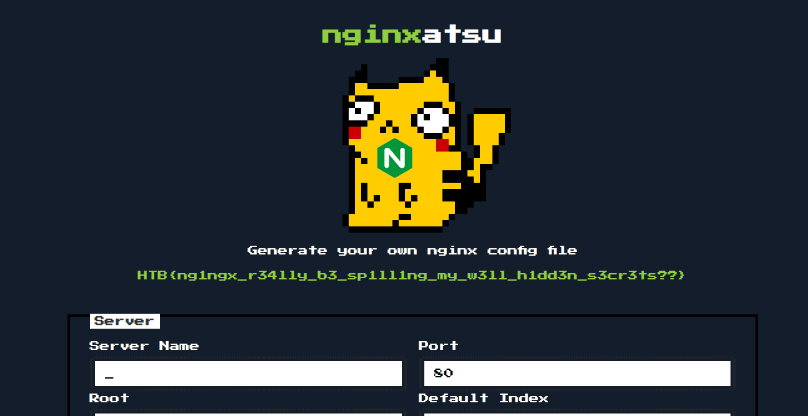

# baby nginxatsu - web challenge

Upon registering, we can create our own nginx configuration files on the server.


>"Generate your own nginx config file"

This might be a hint that the server's configuration file is similar to the generated file.

The provided configuration file is as follows:

```
user www;
pid /run/nginx.pid;
error_log /dev/stderr info;

events {
    worker_connections 1024;
}

http {
    server_tokens off;

    charset utf-8;
    keepalive_timeout 20s;
    sendfile on;
    tcp_nopush on;
    client_max_body_size 2M;

    include  /etc/nginx/mime.types;

    server {
        listen 80;
        server_name _;

        index index.php;
        root /www/public;

        # We sure hope so that we don't spill any secrets
        # within the open directory on /storage
        
        location /storage {
            autoindex on;
        }
        
        location / {
            try_files $uri $uri/ /index.php?$query_string;
            location ~ \.php$ {
                try_files $uri =404;
                fastcgi_pass unix:/run/php-fpm.sock;
                fastcgi_index index.php;
                fastcgi_param SCRIPT_FILENAME $document_root$fastcgi_script_name;
                include fastcgi_params;
            }
        }
    }
}
```

I noticed this part:

```
         # We sure hope so that we don't spill any secrets
        # within the open directory on /storage
        location /storage {
            autoindex on;
        }
```
By enabling autoindex on;, we can list all files in the /storage directory. There are also some comments suggesting that the directory might leak information, so we'll check if it exists on the web server.

It turns out that it does exist:



There is a backup file, lets open it and see if we can find creds.
I opened the DB with SQLite browser and found the creds.



The password hashes seems to be md5, I'll crack them with crackStation.

I got the password for the first user and successfully logged as admin.


